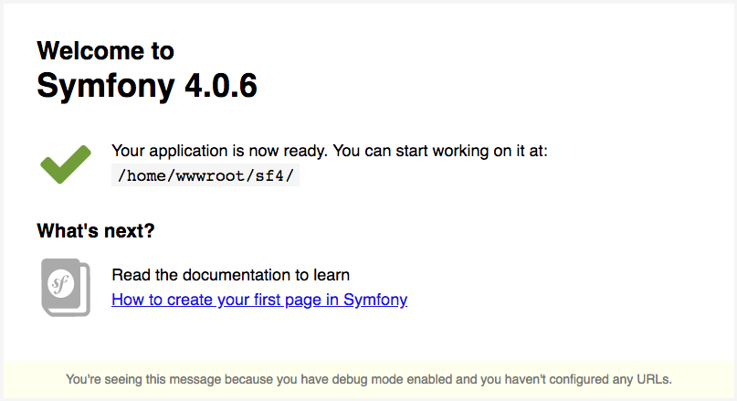

# Create starter for docker and symfony with php 7.2

### 1. how to use docker

```
docker-compose build
```

### At this moment, Docker will execute all configurations that we set up. When it’s done, you can launch your # containers with: 


```
docker-compose up -d
``` 


### 2. How Docker work ? 

### I will not explain how Docker because this is not the subject, but for keep going this post you have to understand two things :

- Each container is one linux distribution with one component
- Each container have one root access by default

### So when you execute this :

```
docker exec -it -u 'container_name' bash
```


### 3. Now we comes to symfony 

### Now we go to the PHP container but not as root, also as dev user (for this example).

```
docker exec -it -u dev 'container_name' bash
```

### Now we are inside of the php container as dev user. 
### For the symfony installation we musst go to the home directory.

> go to Home (sf4)
````
cd /home/wwwroot/sf4
````

> install symfony4 with composer
````
composer create-project symfony/skeleton my-temp-folder
````

> get the project to the root path
````
cp -Rf /home/wwwroot/sf4/my-temp-folder/. .
rm -Rf /home/wwwroot/sf4/my-temp-folder
````

> Now launch our browser with localhost



## Congratulation !! 
### You can now easily start your new Symfony project. If you look inside the docker-compose.yml file you can see all acces as you need.